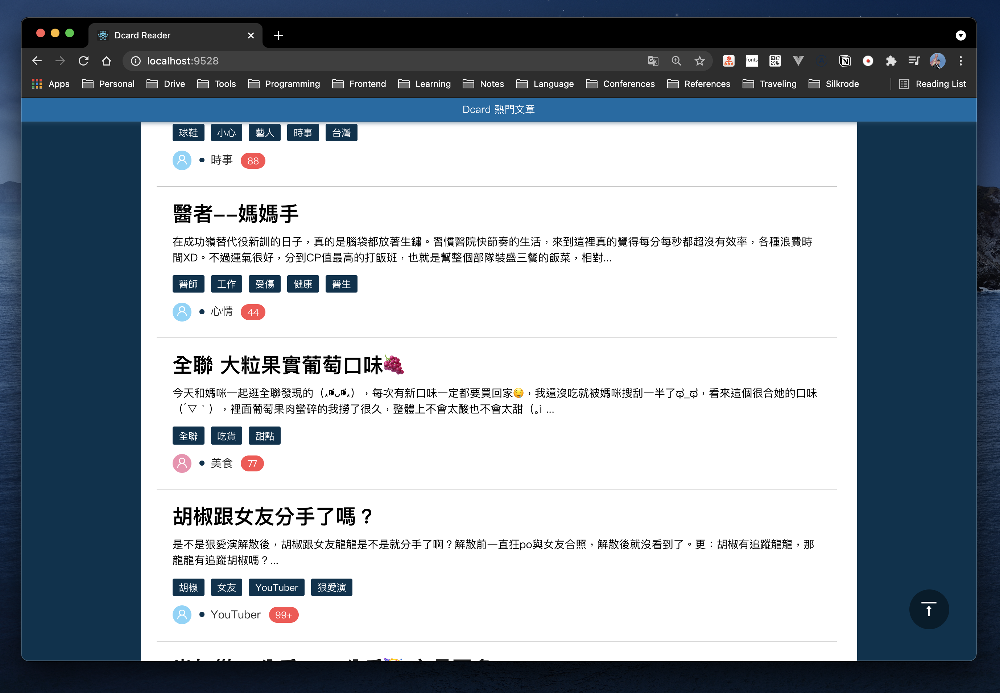

# Dcard Reader



This repository is my first practice to implement a simple post reader for [Dcard](https://www.dcard.tw) using React Hook and TypeScript. For now, you can view the list of the lastest poppular posts, also you can see the content of each post.

> HINT: If you have any questions, please feel free to ask me.

---

## Description

### Excecution

1. To run our production, you need to clone our project first
   ```bash
   $ git clone https://github.com/yungshenglu/Dcard-Reader/
   ```
2. After cloning, change the your current directory into the repository and setup the project
   ```bash
   $ cd Dacrd-Reader/ & yarn install
   ```
   - The command yarn install will install some necessary packages for this project
   - It will take few second for running above command
3. Compiles and hot-reloads for development
   ```bash
   $ yarn start
   ```
   - It will take few second for running above command
   - This command will also start a proxy server on port `9527` to fetch the data from Dcard
   - You won't get any error messages if running successful
4. Congratulation! you can open your browser to `http://localhost:9528` and see our Dcard-Reader

---

## Implementation

### CORS (Cross-Origin Resource Sharing)

> HINT: [CORS on Wiki](https://en.wikipedia.org/wiki/Cross-origin_resource_sharing)

- Implementing a simple **Proxy server** to solve the CORS policy
   - Set the proxy server running on port `9527` via [Express](https://expressjs.com/)
   - You can see the detail of the implementation [here](./app.js)
- The default of the request mode in Express server is `mode: no-cors`
   - Use [CORS](https://www.npmjs.com/package/cors), a Node package for providing a Connect/Express middleware that can be used to enable CORS with various options.
   - You can see the detail of the implementation [here](./app.js)
- In this repository, we only implement the following two APIs in our server: (The detial is in the following **APIs** section)
   - `/api/posts&before=:before`: Fetch the list of the posts
   - `api/post&id=:id`: Fetch the content of the post via post's ID

### Customize Hooks

> HINT: You can see the detail [here](./src/hooks)

- `useFetchPostList`: Fetch the list of the posts
   - There are two cases when triggering this API:
      - Case 1: Entering the page **first time**
      - Case 2: Loading more posts when **scrolling to the bottom** of the page
   - When entering the page **first time**, the parameter of `before` will be 0. After getting the response, do the followings:
      - Set the return data into `postList`
      - Set the status of loading into `false`
      - Set the status of having more post into `true` as default
   - When **scolling to the bottom** of the page, the parameter of `before` will NOT be 0. After getting the response, do the followings:
      - Append the new return data after existed `postList`
      - Set the status of loading into `false`
      - Set the status of having more post into `true` as default
- `useFetchPost`: Fetcg the content the specific post
   - Encapsulate the hook `useAxios` in [`axios-hooks`](https://www.npmjs.com/package/axios-hooks)
   - The only parameters is `postId` (Number) which is to get the post's content you want.
   - Set `manual: true` to avoid triggering the API when rendering
   - The only condition of triggering the API is clicking the post on the list

### Infinite Scrolling

- Using **Intersection Observer API** to implement "Lazy Loading"
   - You can see the detail of the implementation [here](./src/views/Home/Home.tsx)
- The main concept is that we need to *obserse the last item in the list whether is intersect with viewort*.
   - When the last item is intersect with view port, we fetch new post's list after it.
   - Register the DOM of the last post with **Intersection Observer** each time after fetching the list
   - Use `useCallback` to setup the callback function when the taget DOM intersects with the viewport and start observing the target

---
## APIs

- GET: `/api/posts&before=:before`
   - Usage: Fetch the list of posts on Dcard
   - Params:
      - `before` (Number):
         - Return the posts after this ID.
         - If `before` is 0, it will seems to be the first fetching.
   - URL:
      - `before != 0`: `https://www.dcard.tw/v2/posts?before={before}`
      - `before = 0`: `https://www.dcard.tw/v2/posts?popular=true`
- GET: `/api/post&id=:id`
   - Usage: Fetch the content of the post via post ID
   - Params:
      - `id` (Number):
         - Return the content of the post via this ID
   - URL:
      - `https://www.dcard.tw/v2/posts/${id}`

---

## Contributor

> NOTICE: You can follow the contributing process [CONTRIBUTING.md](CONTRIBUTING.md) to join me. I am very welcome for any issue!

- [David Lu](https://github.com/yungshenglu)

---

## License

[WTFPL](LICENSE)
